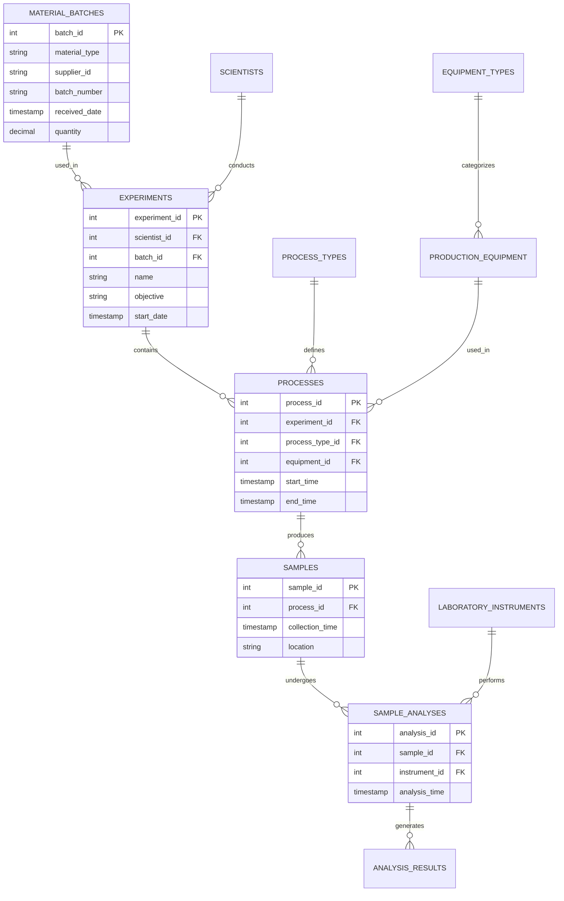

# Entity Relationship Diagram

```mermaid
erDiagram
    MATERIAL_BATCHES ||--o{ EXPERIMENTS : "used_in"
    EXPERIMENTS ||--o{ PROCESSES : "contains"
    PROCESSES ||--o{ SAMPLES : "produces"
    SAMPLES ||--o{ SAMPLE_ANALYSES : "undergoes"
    SAMPLE_ANALYSES ||--o{ ANALYSIS_RESULTS : "generates"
    PROCESS_TYPES ||--o{ PROCESSES : "defines"
    EQUIPMENT_TYPES ||--o{ PRODUCTION_EQUIPMENT : "categorizes"
    PRODUCTION_EQUIPMENT ||--o{ PROCESSES : "used_in"
    LABORATORY_INSTRUMENTS ||--o{ SAMPLE_ANALYSES : "performs"
    SCIENTISTS ||--o{ EXPERIMENTS : "conducts"
    
    MATERIAL_BATCHES {
        int batch_id PK
        string material_type
        string supplier_id
        string batch_number
        timestamp received_date
        decimal quantity
    }
    
    EXPERIMENTS {
        int experiment_id PK
        int scientist_id FK
        int batch_id FK
        string name
        string objective
        timestamp start_date
    }
    
    PROCESSES {
        int process_id PK
        int experiment_id FK
        int process_type_id FK
        int equipment_id FK
        timestamp start_time
        timestamp end_time
    }
    
    SAMPLES {
        int sample_id PK
        int process_id FK
        timestamp collection_time
        string location
    }
    
    SAMPLE_ANALYSES {
        int analysis_id PK
        int sample_id FK
        int instrument_id FK
        timestamp analysis_time
    }
```
